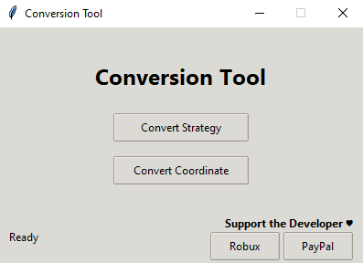
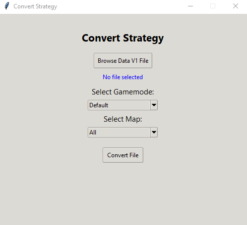
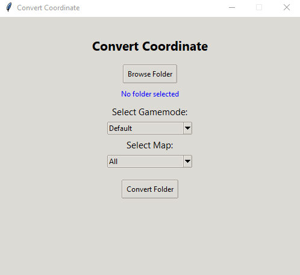
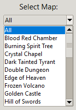

# **Salmon Macro Conversion Tool**

## **I. Tool Name**
**Salmon Macro Conversion Tool**

## **II. What This Tool Does**
This tool converts **Salmon V1 configuration files** into **Salmon V2–compatible configs**.  
It supports both **Strategy** and **Coordinate** conversion with a simple graphical interface.
Although there are still some **limitations** in conversion because of how many functions V2 has cut from V1 and some new functions which makes it impossible to fully convert V1 into V2.
But I still promise it's possible to convert to at least **90-98%** of V1 Strategy (depending on how complicated it is), and fully 100% of V1 Coordinate.

## **Required to be done in Salmon V1**
You need to export your configs first through **Salmon V1**

### **How to**
1. Open **Gamemode**
2. Choose **Config Helper**
3. Input in the **Export** section

## **III. Intended Users**
- Salmon Macro users
- Anyone needing to convert old Salmon configurations into the updated version

## **IV. Screenshots**

-  
-  
-  
-   
-  

## **V. Installation Instructions**

### **A. Python Version (Open Source)**  
1. Install the latest version of Python:  
   https://www.python.org/  
2. Download and unzip **Salmon-Macro-Conversion-Tool**  
3. Open the folder
3. Open **ConversionToolPython** folder  
5. Run:  
   ```
   Convert_Tool.py
   ```  
6. Choose which conversion you want to perform.

### **B. Windows EXE Version (Ready to Use)**  
1. Download and unzip **ConversionTool.zip**  
2. Open the folder  
3. Run:  
   ```
   Convert_Tool.exe
   ```  
4. Choose what you want to convert.

## **VI. Donation Corner**

If you’d like to support the developer 💖:

### **Robux Donations**  
https://www.roblox.com/catalog?Category=3&Subcategory=55&CreatorName=PuellaLunae&salesTypeFilter=1

### **PayPal Donations**  
https://www.paypal.com/paypalme/LunaePuella
